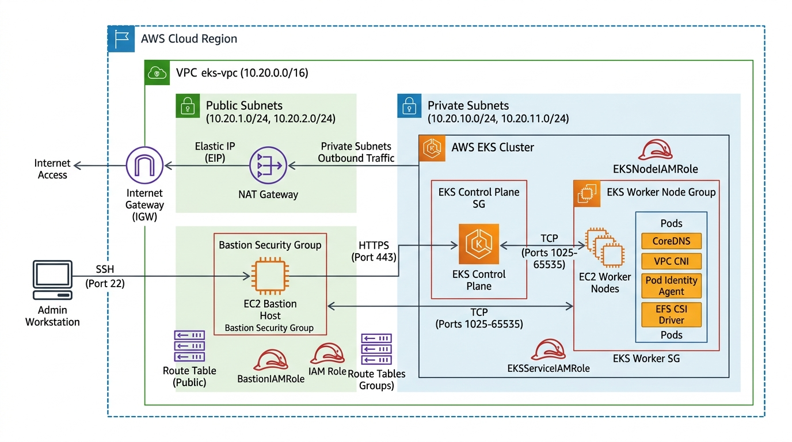

# AWS EKS Cluster Architecture Summary

This document provides a clear, high-level, and easy-to-understand architecture summary of the **Amazon EKS (Elastic Kubernetes Service)** infrastructure.

---

## 🏗️ Architecture Overview



---

## 1. ☸️ EKS Cluster & IAM Configuration

### IAM Roles & Policies

| Role Name | Trusted Entity (Service) | Attached Policies | Description / Purpose |
| :--- | :--- | :--- | :--- |
| **EKS cluster role** | `eks.amazonaws.com` | • `AmazonEKSClusterPolicy`<br>• `AmazonEKSVPCResourceController` | Grants EKS Control Plane permissions to manage AWS infrastructure. The **VPC Resource Controller** allows assigning AWS Security Groups directly to individual pods (Security Groups for Pods). |
| **Node Iam role** | `ec2.amazonaws.com` | • `AmazonEC2ContainerRegistryReadOnly`<br>• `AmazonEKS_CNI_Policy`<br>• `AmazonEKSWorkerNodePolicy` | Grants worker nodes permission to pull images from AWS ECR, configure pod networking via AWS VPC CNI, and join/register with the EKS Control Plane. |

---

## 2. 💻 Node Groups

- **Node Group Quantity**: At least **1 Node Group** is maintained. This baseline node group is necessary when using **Karpenter** so that the Karpenter controller pod has compute resources to run and handle dynamic node autoscaling.
- **Subnet Placement**: Attached to **both Private Subnets** to keep worker nodes isolated from direct internet access.
- **Node Security Group (`EKS nodegroup sg`)**:
  - **Inbound Rule 1 (`TCP 1025-65535`)**: Allows worker nodes to receive communication, logs, and exec commands from the EKS Control Plane.
  - **Inbound Rule 2 (`All TCP from Self SG`)**: Allows node-to-node communication across all nodes in the security group for internal pod workload traffic.

---

## 3. 🌐 Cluster Networking & Security Groups

### Security Group Ingress / Egress Matrix

| Security Group Name | Protocol / Ports | Source | Purpose |
| :--- | :--- | :--- | :--- |
| **EKS cluster security group** | `All TCP` | Self Security Group | Allows control plane communication and EFA traffic not matched by CIDR rules. |
| **EKS cluster security group** | `HTTPS (Port 443)` | Bastion Security Group | Allows administrative access from the Bastion host to the EKS private API control plane. |
| **EKS cluster security group** | `HTTPS (Port 443)` | Worker Node Security Group | Allows worker nodes to communicate with the EKS Control Plane API. |
| **EKS nodegroup sg** | `TCP (1025–65535)` | EKS Control Plane | Allows Control Plane traffic to worker nodes. |
| **EKS nodegroup sg** | `All TCP` | Self Security Group | Enables inter-node communication between worker nodes. |
| **Bastion SG** | `SSH (Port 22)` | Restricted to `currentIP` | Restricts remote management access strictly to authorized administrator IP addresses. |

---

## 4. 🧩 EKS Add-ons

The EKS cluster includes 5 key add-ons:

1. **CoreDNS**: Provides cluster-internal DNS resolution for Kubernetes services and pods.
2. **kube-proxy**: Maintains network rules on nodes and handles TCP/UDP packet forwarding for Kubernetes Services.
3. **VPC CNI (`vpc-cni`)**: Integrates Kubernetes pods directly with AWS VPC networking, allocating native VPC IP addresses to pods.
4. **Pod Identity Agent (`eks-pod-identity-agent`)**: Enables EKS Pod Identity, allowing pods to easily assume AWS IAM roles using temporary credentials.
5. **EFS CSI Driver (`aws-efs-csi-driver`)**: Enables persistent shared file storage for pods using AWS Elastic File System (EFS).

---

## 5. 🗺️ VPC Infrastructure

### Network Specifications

- **VPC Name**: `eks-vpc`
- **VPC CIDR**: `10.20.0.0/16`
- **Subnets**: Total **4 Subnets** (2 Private subnets and 2 Public subnets across Availability Zones).
- **Internet Gateway (IGW)**: **1 Internet Gateway** attached to `eks-vpc` for public network access.
- **NAT Gateway**: **1 NAT Gateway** deployed in a public subnet.
- **Static IP**: **1 Elastic IP (EIP)** assigned to the NAT Gateway.

### Subnet & Route Table Setup

```
                    [ Public Route Table 1 ] --------> Internet Gateway (0.0.0.0/0)
                    [ Public Route Table 2 ] --------> Internet Gateway (0.0.0.0/0)

                    [ Private Route Table 1 ] -------> NAT Gateway (0.0.0.0/0)
                    [ Private Route Table 2 ] -------> NAT Gateway (0.0.0.0/0)
```

| Route Table | Type | Target | Subnet Association | Description |
| :--- | :--- | :--- | :--- | :--- |
| **Public Route Table 1** | Public | Internet Gateway (`igw`) | Public Subnet 1 | Routes public subnet outbound traffic directly to the internet. |
| **Public Route Table 2** | Public | Internet Gateway (`igw`) | Public Subnet 2 | Routes public subnet outbound traffic directly to the internet. |
| **Private Route Table 1** | Private | NAT Gateway (`nat`) | Private Subnet 1 | Routes private workload outbound traffic securely via NAT Gateway. |
| **Private Route Table 2** | Private | NAT Gateway (`nat`) | Private Subnet 2 | Routes private workload outbound traffic securely via NAT Gateway. |

---

## 6. 🔒 Operational Security & Bastion Host

- **Bastion Security Group**: Restricts SSH inbound access (Port 22) exclusively to the administrator's **currentIP**.
- **Bastion IAM Role**: Includes **1 IAM Role** attached to the Bastion host instance to authorize administrative operations without storing hardcoded static credentials on the machine.
